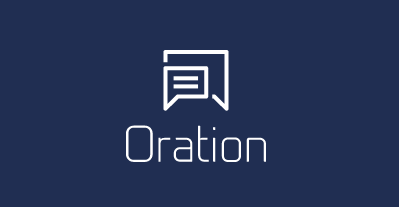

A Rocket/Elm self hosted commenting system for static sites.

Inspired by [Isso](https://posativ.org/isso/), which is a welcomed change from Disqus.
However, the codebase is unmaintained and [security concerns](https://axiomatic.neophilus.net/posts/2017-04-16-from-disqus-to-isso.html) abound.

*Oration* aims to be a fast, lightweight and secure platform for your comments. Nothing more, but importantly, nothing less.

# Development Startup

```bash
$ export DATABASE_URL=oration.db
$ diesel migration run
$ cd app
$ brunch build
$ cd ..
$ cargo run
```

for live reloading of `app` files:

```bash
$ cd app
$ npm run watch
```

